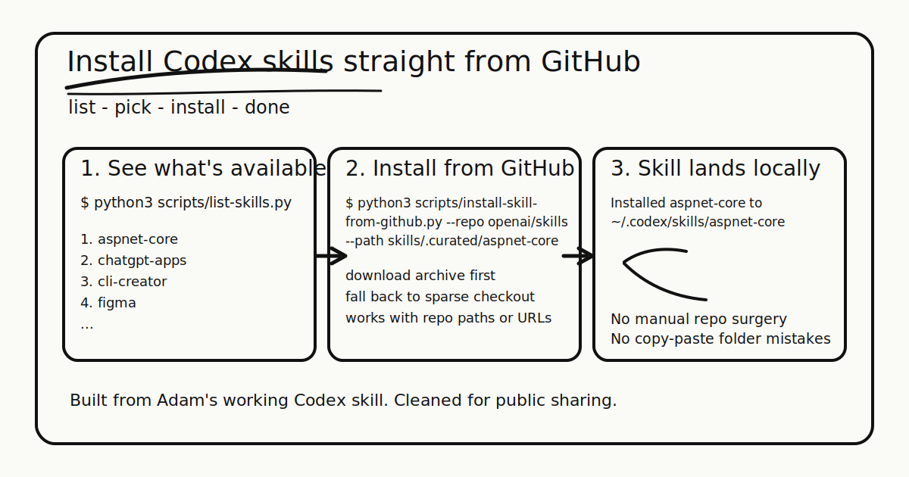

# Install Codex Skills From GitHub In One Command

`codex-skill-installer` is a small utility for listing Codex-installable skills and copying them into `$CODEX_HOME/skills` without cloning whole repos or doing manual folder surgery.

It supports:

- listing curated skills from GitHub
- installing a skill from an `owner/repo` plus path
- installing from a full GitHub URL
- installing multiple skills in one run
- public repos via direct download
- private repos or auth-required repos via sparse checkout fallback



## At A Glance

- list installable skills before you pick one
- install directly from a repo path or GitHub URL
- keep private repo support through existing git auth or `GH_TOKEN`
- default to `${CODEX_HOME:-~/.codex}/skills` so the result lands where Codex expects it

## Why This Exists

Most shareable Codex skills live inside bigger repos. Copying them by hand is tedious, and private repos are worse. This tool gives you a predictable install path with a couple of commands.

It is also packaged as a Codex skill, so you can drop this repo into your own skill collection or adapt the scripts directly.

## Quick Start

List curated skills:

```bash
python3 scripts/list-skills.py
```

Install from a repo path:

```bash
python3 scripts/install-skill-from-github.py \
  --repo openai/skills \
  --path skills/.curated/aspnet-core
```

Install from a full GitHub URL:

```bash
python3 scripts/install-skill-from-github.py \
  --url https://github.com/openai/skills/tree/main/skills/.curated/aspnet-core
```

Install into a custom directory:

```bash
python3 scripts/install-skill-from-github.py \
  --repo openai/skills \
  --path skills/.curated/aspnet-core \
  --dest ./sandbox-skills
```

Install multiple skills in one run:

```bash
python3 scripts/install-skill-from-github.py \
  --repo openai/skills \
  --path skills/.curated/aspnet-core skills/.curated/figma
```

## Requirements

- Python 3
- `git`
- `curl`

`curl` is used as a practical fallback when local Python SSL certificate chains are broken, which happens on some macOS setups.

## Behavior

- installs into `$CODEX_HOME/skills` by default
- uses `~/.codex` when `CODEX_HOME` is not set
- fails fast if the destination skill already exists
- validates that skill paths stay inside the source repo
- accepts `GITHUB_TOKEN` or `GH_TOKEN` for private repo access
- falls back from archive download to sparse checkout when needed
- supports `--method auto|download|git` when you need to force a path
- supports `--name` when you want a custom installed skill directory name

## Private Repo Notes

For private repos, either of these usually works:

- existing local git credentials for sparse checkout fallback
- `GH_TOKEN` or `GITHUB_TOKEN` for authenticated download requests

The scripts do not persist credentials. They only read token env vars already present in your shell session.

## Smoke-Tested Examples

The scripts were verified on `2026-05-20` with:

```bash
python3 scripts/list-skills.py
python3 scripts/install-skill-from-github.py \
  --repo openai/skills \
  --path skills/.curated/aspnet-core \
  --dest "$(mktemp -d)"
python3 scripts/install-skill-from-github.py \
  --url https://github.com/openai/skills/tree/main/skills/.curated/aspnet-core \
  --dest "$(mktemp -d)"
```

## Repo Layout

- `scripts/list-skills.py`: list installable skills from a GitHub repo path
- `scripts/install-skill-from-github.py`: install one or more skills into a Codex skills directory
- `scripts/github_utils.py`: shared GitHub request helpers
- `SKILL.md`: Codex skill wrapper for using the installer inside Codex

## Notes

This repo is a cleaned public extraction of a working local Codex skill. Personal machine paths, account-specific state, tokens, and private notes are not included.
